# 记录学习档案
## Python
与C++很不同的点：  
①不用分号，使用缩进  
②输出默认换行，使用,来不换行，如 `print('a'),`

语法重点：  
输出列表，会把[]也输出出来  

Python的索引除了0,1,2,3还同时对应-n,-n+1等，也就是说十位列表第一位既是a[0]也是a[-10]  

列表/字符串/元组可以切片，for instance：*设a=[0,1,2...9]*  
`a[-5:9]`表示输出-5对应到9对应之前，也就是5~8，超出范围的部分记为空，start大于stop输出空；   
`a[::2]`表示输出第0、2、4……位，缺省部分尽量大范围；  
`a[::-1]`表示输出9、8、7……位，步长为负会默认从最大开始；  
 `print (str[n:m:o])` 表示的是从索引从n到m隔o个输出一位  
>另外，为什么`a[0::-1]`会有输出而`a[0:len(a):-1]`无输出?因为缺省没有规定方向，取了0后发现没东西可取，而len有方向，要求步长必须为正，否则取不出东西  

*拆list/tuple，**拆字典，使得内容一一对应：  
列表：`print("网站名：{0[0]}, 地址 {0[1]}".format(my_list))`==`print("网站名：{0}, 地址 {1}".format(*my_list))`
字典：`d = {'name': 'Tom', 'age': 20}， print('{name} {age}'.format(**d))`

正则表达式，如`result=re.match(r'(\w+) is \$(\d+)\.(\d+)' , 'rice is $5.00')`括号表示分组，使用`result.group(n)`选出第n个括号里的东西，且`+`表示匹配一个或多个，`?`表示零个或一个，`*`表示零个或多个

## Machine Learning
>Regression：回归————输入一个或多个参数后输出标量  
Classification：输入一个事物，从已知选项里面输出一个  
Structure：创造  
  
   

对于已知量的乘叫权重weight，另外加上的是bias  
Loss：一组权重+bias好的程度，如何判断？拿已知的多个数值(feature)带入，比如已知x1、x2，拿x1去估计x2看差别（此时真正的x2称label）得到差绝对值为e1（Mean Absolute Error，另外还有差距绝对值称Mean Square Error），以此类推Loss= $\frac{1}{n}$ $\displaystyle\sum^n_1$ ek  
**Example：**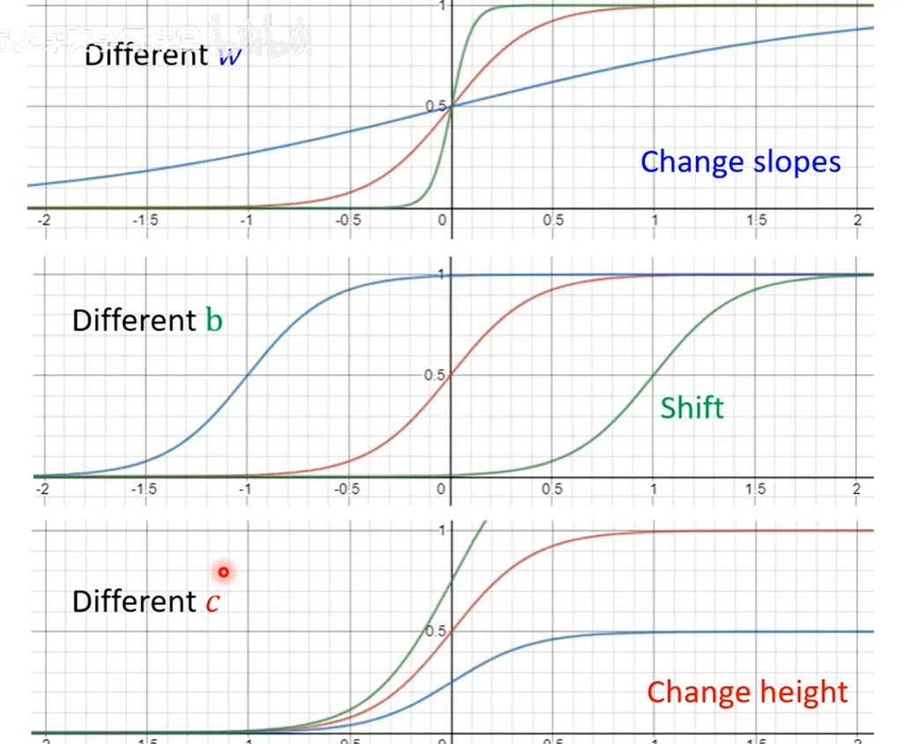  

>优化方法Optimization：梯度下降Gradient Descent  
### 对于线性模型y=wx+b
先不看bias，仅变化权重w观察Loss变化————先随机取w0，然后计算w0 - η*(w0处L关于w导数)，直到 ①变化次数太多，手动停下②L关于w微分为0   
>超参数Hyperparameter：需要手动设置的参数，即上述的η(Learning Rate学习速率)、变化上限次数  

一个小问题是两种停止方式停在的那点(Local Minima)都不一定是找到最好的那点(Global Minima)，但这并不重要（后面会讲）  
 
同样对bias做如上微分迭代计算，两个迭代结合，会在等高线图上向Loss低(负梯度)的方向前进 

若参数分布有周期性，假设为7，使用 $\displaystyle\sum^{k+7}_{i=k+1}$ xi作为feature

###  y和x不成完全linear关系————非线性模型
写更sophisticated的function
使用Piecewise Linear Curve（分段的直线）或者说多个Hard Sigmoid Function，可以组合表示任意曲线
用纠正线性单元Rectified Linear Unit（max函数）表示Hard Sigmoid

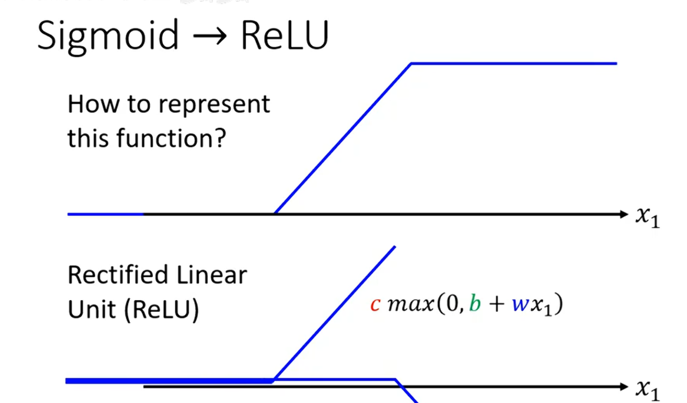

另外用Sigmoid Function

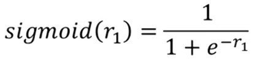  
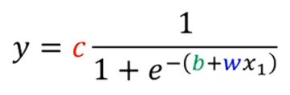 

可以逼近任意Hard Sigmoid Function  

>ReLU和Sigmoid统称Activation Function

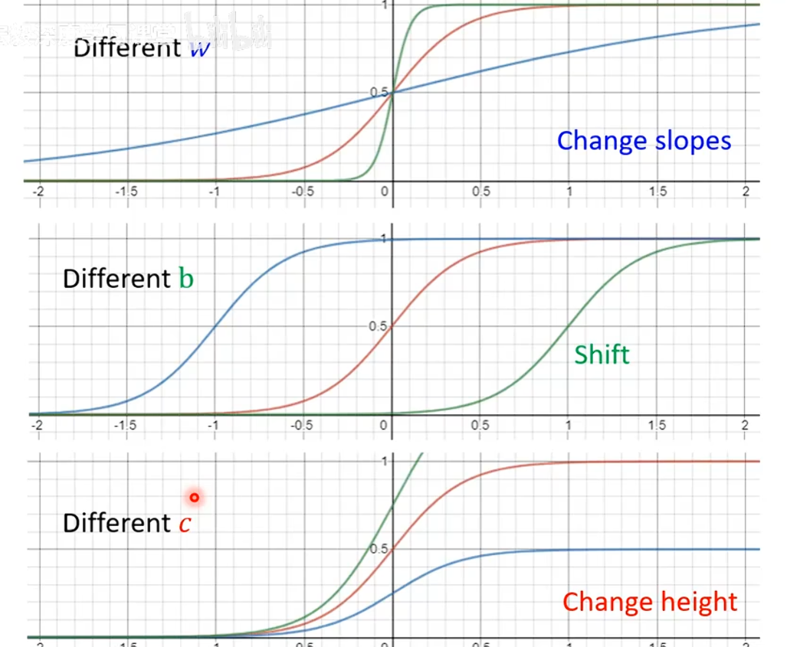  

多个不同c、b、w的曲线相加可拟合弯曲线段  
对于周期分布  

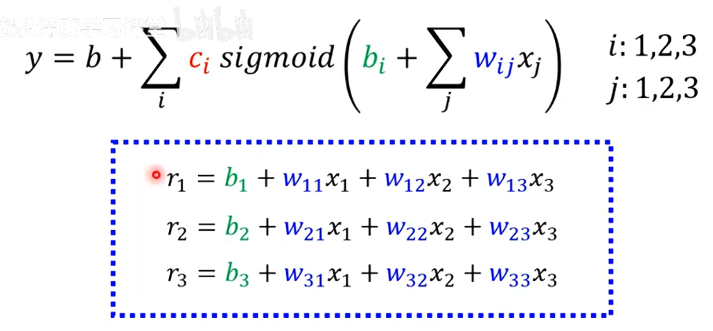  

也可以写作 **r=b+Wx**矩阵运算 

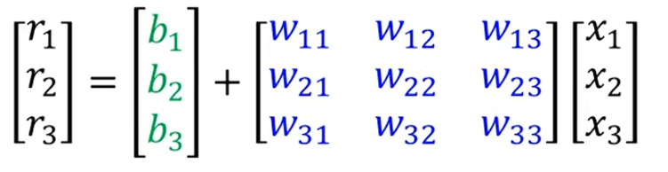  

最终 **a=σ\*r** , **y=b+ c^T \*a**  
未知参数统一竖直排列在矩阵中，称为 **θ**, 如c、b、W  
Loss函数就变成L(**θ**)  
可以直接对每个θi求梯度得到向量 **g** = $\nabla$ L(**θ**) ,更新θi  
当θ太多的时候，把**θ**切割成很多个batch，对前一个batch求**g** 从而update θi，用这些θi 代入后一个batch，以此类推，直到解决整个**θ**，称为一个epoch 

这一个过程嵌套多次，即用拟合出的曲线更精确地拟合，成为神经网络/深度学习

嵌套次数与Loss的关系：4层时对未来的预测恶化了，发生过拟合

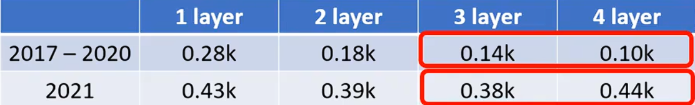

### 模型训练
模型层数大dev与training loss却比简单模型差：optimization出问题，而不是overfitting，如果是overfitting，training loss应该会降低  

Overfitting：解决办法  
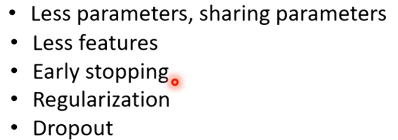  

Mismatch:和overfitting有点像，但是偏向是overfitting是只会记训练资料不会变通但是train和dev总体没有很大区别，mismatch指的则是给出的训练资料就是不正确与实际运用资料不是一个方向的  

Optimization：Loss随着层数不下降了，可能卡在gradient为0点即critical point（local minima或saddle point）
>实际上真正模型训练的时候local minima很少出现，因为参数非常多，维度很高，可以走的路会很多  
  
任意一处的L(**θ**)可以表示为  
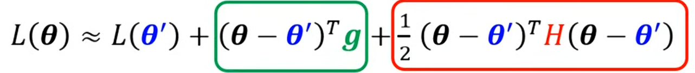
在critical point 绿色部分为0，看红色部分，始终<0则maxima，>0则minima，有大有小saddle。
**也即：看H矩阵的特征值eigen value，恒正maxima，恒负minima，有正有负saddle** 
**当是saddle的时候，设某个特征值λ<0对应特征向量为u，令新θ=θ'+u即可继续降低loss**  
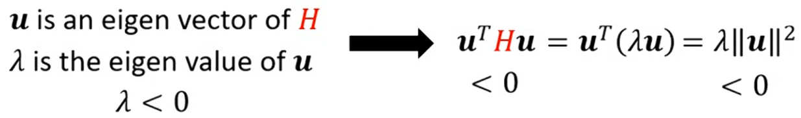
