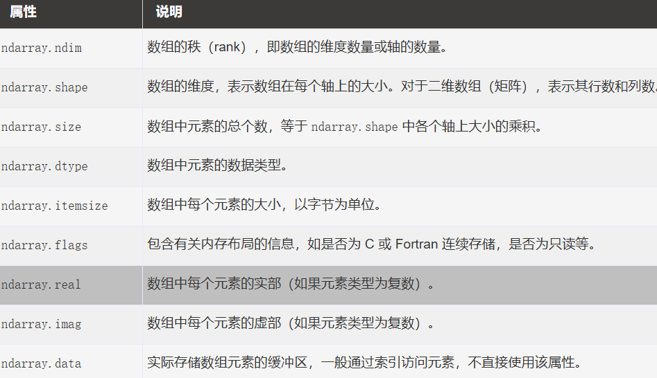
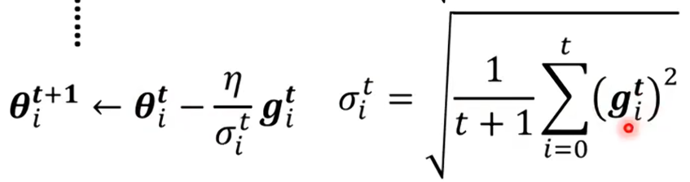
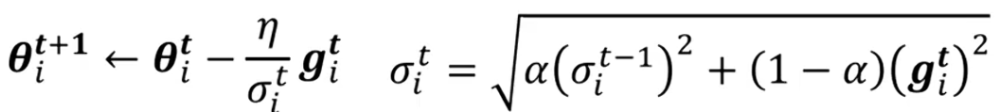
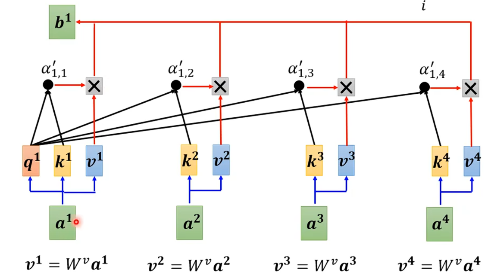
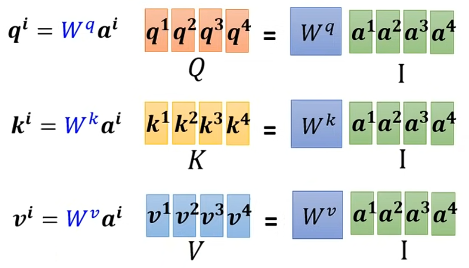
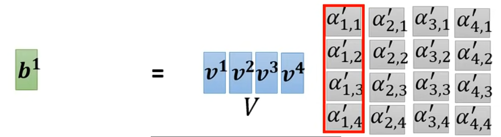

# 记录学习档案
## Python
与C++很不同的点：  
①不用分号，使用缩进  
②输出默认换行，使用,来不换行，如 `print('a'),`

语法重点：  
输出列表，会把[]也输出出来  

Python的索引除了0,1,2,3还同时对应-n,-n+1等，也就是说十位列表第一位既是a[0]也是a[-10]  

列表/字符串/元组可以切片，for instance：*设a=[0,1,2...9]*  
`a[-5:9]`表示输出-5对应到9对应之前，也就是5~8，超出范围的部分记为空，start大于stop输出空；   
`a[::2]`表示输出第0、2、4……位，缺省部分尽量大范围；  
`a[::-1]`表示输出9、8、7……位，步长为负会默认从最大开始；  
 `print (str[n:m:o])` 表示的是从索引从n到m隔o个输出一位  
>另外，为什么`a[0::-1]`会有输出而`a[0:len(a):-1]`无输出?因为缺省没有规定方向，取了0后发现没东西可取，而len有方向，要求步长必须为正，否则取不出东西  

*拆list/tuple，**拆字典，使得内容一一对应：  
列表：`print("网站名：{0[0]}, 地址 {0[1]}".format(my_list))`==`print("网站名：{0}, 地址 {1}".format(*my_list))`
字典：`d = {'name': 'Tom', 'age': 20}， print('{name} {age}'.format(**d))`


正则表达式，如`result=re.match(r'(\w+) is \$(\d+)\.(\d+)' , 'rice is $5.00')`括号表示分组，使用`result.group(n)`选出第n个括号里的东西，且`+`表示匹配一个或多个，`?`表示零个或一个，`*`表示零个或多个  

`Store_true`在参数中表示不写为false，写了就是true，如`p.add_argument("--do_sample", action="store_true)"`

### Numpy:  
dtype:  
可自创类型，比如`dt=np.dtype([('A',86),('B',315)])`，以后创建一个array `x=np.array(dtype=dt)`就可以直接用这个类型  
可用于动态判断数据类型，如`dt=np.dtype(某个东西)`,使用dt.kind可以知道是什么(kind是dtype下的方法，输出简化类型符如f、i、c)  
 

数组ndarray:  
·创建：`x = np.empty([3,2], dtype = int) ` 或者 `x = np.zeros([3,2], dtype = int) `后者会先自动初始化先 ； `logspace`创建等比数列,`linspace`创建等差数列  
·复制创建：把list、tuple转化为数组`a = np.asarray(x) ` 或`a = np.array(x) `前者若本来x是array就直接调用不会新建，省空间  
·输出：默认元素之间没有逗号 (虽然和list一样都是方括号)  ；  
``` 
切片输出 
    a = np.array([[1,2,3],[3,4,5],[4,5,6]])  
    print (a[...,1])   # 第2列元素  
    print (a[1,...])   # 第2行元素  
    print (a[...,1:])  # 第2列及剩下的所有元素  
```
```
高级索引
    x = np.array([[  0,  1,  2],[  3,  4,  5],[  6,  7,  8],[  9,  10,  11]])
    y = x[[0,0,3,3], [0,2,0,2]]  
    #y == [x[0,0], x[0,2], x[3,0], x[3,2]]   表示分别取出了0，1，2维中的第0，1，0个元素，是平面化的
    而若
    y=x[[[0,0],[3,3]],[[0,2],[0,2]]]
    #y = [
    [x[0,0], x[0,2]],
    [x[3,0], x[3,2]]
    ]                                        变成了二维，多包了一层
```
```
布尔索引
    x = np.array([[  0,  1,  2],[  3,  4,  5],[  6,  7,  8],[  9,  10,  11]])  
    print (x[x >  5]) #会把x中满足>5的输出出来，原理是按x的结构生成一个0，1数组，输出1位置的元素
    print (x[k >  5]) #体现底层原理，会按照k的结构生成0，1矩阵，从而输出x中对应1位置的元素
```

## Machine Learning
>Regression：回归————输入一个或多个参数后输出标量  
Classification：输入一个事物，从已知选项里面输出一个  
Structure：创造  
  
   

对于已知量的乘叫权重weight，另外加上的是bias  
Loss：一组权重+bias好的程度，如何判断？拿已知的多个数值(feature)带入，比如已知x1、x2，拿x1去估计x2看差别（此时真正的x2称label）得到差绝对值为e1（Mean Absolute Error，另外还有差距绝对值称Mean Square Error），以此类推Loss= $\frac{1}{n}$ $\displaystyle\sum^n_1$ ek  
**Example：**  

>优化方法Optimization：梯度下降Gradient Descent  
### 对于线性模型y=wx+b
先不看bias，仅变化权重w观察Loss变化————先随机取w0，然后计算w0 - η*(w0处L关于w导数)，直到 ①变化次数太多，手动停下②L关于w微分为0   
>超参数Hyperparameter：需要手动设置的参数，即上述的η(Learning Rate学习速率)、变化上限次数、Batch size  

一个小问题是两种停止方式停在的那点(Local Minima)都不一定是找到最好的那点(Global Minima)，但这并不重要（后面会讲）  
 
同样对bias做如上微分迭代计算，两个迭代结合，会在等高线图上向Loss低(负梯度)的方向前进 

若参数分布有周期性，假设为7，使用 $\displaystyle\sum^{k+7}_{i=k+1}$ xi作为feature

###  y和x不成完全linear关系————非线性模型
写更sophisticated的function
使用Piecewise Linear Curve（分段的直线）或者说多个Hard Sigmoid Function，可以组合表示任意曲线
用纠正线性单元Rectified Linear Unit（max函数）表示Hard Sigmoid


另外用Sigmoid Function

  
 

可以逼近任意Hard Sigmoid Function  

>ReLU和Sigmoid统称Activation Function

  

多个不同c、b、w的曲线相加可拟合弯曲线段  
对于周期分布  

  

也可以写作 **r=b+Wx**矩阵运算 

  

最终 **a=σ\*r** , **y=b+ c^T \*a**  
未知参数统一竖直排列在矩阵中，称为 **θ**, 如c、b、W  
Loss函数就变成L(**θ**)  
可以直接对每个θi求梯度得到向量 **g** = $\nabla$ L(**θ**) ,更新θi  
当θ太多的时候，把**θ**切割成很多个batch，对前一个batch求**g** 从而update θi，用这些θi 代入后一个batch，以此类推，直到解决整个**θ**，称为一个epoch 

这一个过程嵌套多次，即用拟合出的曲线更精确地拟合，成为神经网络/深度学习

嵌套次数与Loss的关系：4层时对未来的预测恶化了，发生过拟合


### 模型训练
模型层数大dev与training loss却比简单模型差：optimization出问题，而不是overfitting，如果是overfitting，training loss应该会降低  

Overfitting：解决办法 
Regularization正则化是在Loss Function中加入惩罚项（一个有关未知参数的项，如：L1——权重绝对值之和；L2——权重平方和）可以缓解为了不断贴近train点而急剧变化的权重 
  

Mismatch:和overfitting有点像，但是偏向是overfitting是只会记训练资料不会变通但是train和dev总体没有很大区别，mismatch指的则是给出的训练资料就是不正确与实际运用资料不是一个方向的  

Optimization：Loss随着层数不下降了，可能卡在gradient为0点即critical point（local minima或saddle point）
>实际上真正模型训练的时候local minima很少出现，因为参数非常多，维度很高，可以走的路会很多  
  
任意一处的L(**θ**)可以表示为  

在critical point 绿色部分为0，看红色部分，始终<0则maxima，>0则minima，有大有小saddle。
**也即：看H矩阵的特征值eigen value，恒正maxima，恒负minima，有正有负saddle** 
**当是saddle的时候，设某个特征值λ<0对应特征向量为u，令新θ=θ'+u即可继续降低loss**  
  

Batch:一次参数update用到的数据组，越小越noisy，但是由于更新次数多，每次算Loss函数都不一样，不容易卡在local minima特别是陡峭的minima，**表现更好**。由于GPU有并行计算能力，所以在一定的batch size范围内完成一个batch计算的时间是接近的，所以适当增加batch size**有利于效率**  

Momentum:惯性方法，克服小坡继续寻找低点，即**θ**原来是**θ0**-η**g**，现在是记录每次移动方向**m**，**θ**=**θ0**+λ**m0**--η**g**  

Adaptive Learning Rate：按照前进方向陡峭程度，比如每次学习率η改为RMS  
  

改进为RMSProp，减少太久远的g对现在的影响    
  

RMSP+Momentum就是**Adam**方法  

Learning Rate Decay:η慢慢下降
Warm Up ：η先升后降

有warm up的adam：RAdam  

Loss Function的优化：Softmax函数与Cross Entropy交叉熵(使用CE默认在最后一层调用Softmax)：对一个一维向量，把其中所有元素变成$\frac{Exp原元素}{\sum Exp元素}$归一化（相加为1），Loss函数定义为$-\sum y_{label}*ln (输出概率)$  

### 模型分类  
#### CNN卷积神经网络：
应用1 影像识别  
图片由三维tensor组成————长/宽/channel（RGB三层） 
每个neural分治一小部分receptive field(感受野)，判断一个pattern  
receptive field大小为kernel size，常见为3*3  
平移获得另外一个field的距离为stride，一般为1\2让field之间有重叠 ，如果不断按照stride超出影响范围就做padding(补值)，可以补0\补全图平均什么的    

Convolution：Convolutional layer 中先取一个确定的Filter，取图片中按照给定的stride每个field一个一个进行点对点相乘求和(卷积)，得出每个field的和，每个filter与图片每个field运算得出一个feature map，所有feature maps叠起来可以看作一张新图片(若有64个filter就有64channels)。如果继续叠加convolutional layer，那么下一层filter要有64个channel

3\*3的field好像很小？其实在经过一次stride为1的layer后会发现，新图片中的3\*3区域实际上包括了原图片中的5\*5

可以理解为一个filter用于判断某些pattern，卷积一层就得出“哪里相似度高”的新图片  

Pooling池化：减少运算量。feature map里分组，选择组中某一个，缩小图片(如2*2只取一个值缩小为1个)

Flatten：老CNN常用(现代直接Global Average Pooling为单列向量送入softmax)
经过卷积、池化后向量flatten拍扁，用于塞进全连接层(将学到的“分布式特征表示”映射到样本标记空间)，最后处理输出


CNN应用2 下围棋。  
下围棋是一个19\*19个目标的分类问题。某个位置有黑、白子或无东西设定数字。为什么CNN比普通全连接层更好？看作图片，AlphaGo中每个情况都可以用48个channel描述，第一层共192个5\*5的fielter，后续层3\*3，但是没有用池化，因为会损失对局细节。

#### Self Attention
之前我们讨论的都是单输入一个向量，现在如果输入一连串东西呢？  
比如一串文字？怎么把他们转化为向量？   
有一个办法是建很大的一维onehot向量，每个词对应一个向量。   
比如一段声音？怎么转化为向量？ 
经验做法是取25ms，转化为一个向量，然后移动10ms，再取样  
比如一个节点图、一个分子，一个点可以看作一个onehot向量。 **问题是，无法发现每个向量之间的关系，比如I saw a saw这个句子ai无法辨别出saw的词性**  
如果要运用FC,就要把所有向量一次全部读入，参数很多，太麻烦
引入self attention来同时看到context!  
多个向量a1~an输入后先进入self attention层处理，在其中考虑每一个之间的关系再输出b1~bn  
对于一个向量ak，需要找出其他a与ak的relevant程度 **α**  
对于输入ak与ai，分别乘上矩阵Wq与Wk得到q与k
>q=query,是对于原;k=key,是对于目标;v=value,是对于最后输出值相对大小

做法1：qk作点乘得到 **α**ki 
做法2：q+k然后经过tanh和W处理得到 **α**ki  
要注意自己也要和自己计算关联性  
做法1最为常见，可以得到一个n*n数值矩阵，每一列都是某个a和其他的关联性，现在把每一列送入softmax归一化，得到一个全是 **α**’的矩阵.最后使用一个Wv矩阵乘每一个ak，得出一个一维向量，与 **α**’相乘得到最后的输出b


把qkv组成的矩阵称为QKV



  
全是**α**'的矩阵可称为attention matrix (A')  
**Output** = **V** * **A'**  

其中几个W矩阵是未知权重  

Multi-Head Attention多头注意力  
寻找多种相关性，此时q、k、v的个数i同步增加，均由原来的qkv乘i个矩阵得到。但注意后续操作仅在一头中进行(如q1,3仅与k1,3和v1,3进行运算)  

另外，注意到self attention接受输入的时候其实并不像人一样知道每个向量之间的位置关系，①此时根据人类所知的情况在输入向量上加一个position向量(加上不会变成其他的输入造成紊乱，因为对于模型，那个向量天生就代表“第一个位置的香蕉”而不是两者之和)②先分析位置，对qk向量做变换  

对比CNN：用self attention处理图片，如m\*n\*k图片，看作 m*n 个 k维向量输入，即考虑每个pixel(像素)之间的关系，其实就是是一个pro版的，模型自己通过学习判断相关域的CNN，训练资料越来越多的时候可以超过传统CNN  

对比RNN：RNN需要串行处理，之前得出的output要先存下来等后面的RNN单元去处理；self attention是并行处理  

self attention用于点边图：已知点之间的关系了，所以不需要考虑没有点链接的点，那么**A**'矩阵应该仅有部分有效，这就是GNN  

self attention问题在运算量太复杂，复杂度是输入的平方  

#### Batch Normalization  
是避免某些权重变化Loss变化很大而有些权重变化时Loss变化很小的我不平衡，有利于训练迭代速度  
举例：
train时，有一批输入vector，取出每个向量里面同一维的数进行平均值mean运算和standard deviation标准差σ运算，然后作 $\frac{x-mean}{σ}$ 运算，所有的数值都会大致在0上下  
可以在每一层输入前都做一次  
**归一化根本不是为了改变“谁大谁小”，而是为了把数据硬塞进激活函数的“有效工作区”比如，对于后面的 ReLU 激活函数，如果你数据均值是0，就会有一半的神经元被无情地“掐死”（输出0）。网络只是想稍微把均值往上挪一点，或者把方差稍微拉大一点，让更多的神经元活过来。**  
    
Batch Normalization：以一个规模 **相对较大**（需要算出好的mean和σ）的batch为单位进行normalization  

Test的时候，考虑问题：在实际工作时不一定有batch概念，normalization设定的batch size没用了，pytorch有动态计算mean和σ的方法  

要注意的是，在进行 $\frac{x-mean}{σ}$ 运算后比如说得到y'，还要进行y''=γ y''+ β的变换!!!  γ 与 β 类似权重，是模型自己训出来的，反正这个黑盒子都是往loss小的地方前进  

>>举例子：有的歌手嗓门极大（数据值几万），如果直接放出来，音响会炸（梯度爆炸）。  
有的歌手嗓门极小（数据值零点几），如果直接放出来，根本听不见（梯度消失）。  
归一化，就是调音师强行把所有人的音量旋钮拧到中间位置（均值0，标准音量1）。  
这下好了，不管是谁唱歌，至少音响不会炸，观众也能听见。这就是归一化的功劳：保命，让网络能跑下去。
第二步：为什么归一化后必须变换？（恢复特征）  
摇滚歌手本来就该声嘶力竭，抒情歌手本来就该浅唱低吟。你强行把所有人音量拧到“中等”，虽然安全了，但所有歌曲的情感特征全被抹平了！这就是所谓的“过度矫正”。  
如果你不做变换，网络就只会处理这种“没感情的中等音量”，它学不到摇滚和抒情的区别。  
变换（乘 γ，加 β），就是把“音量旋钮”交还给网络自己。  
网络在学习中发现：“哎，这个特征是个摇滚特征，需要大音量！” 它就会把 γ 学得很大，把 β 调高，主动把音量重新拉大。网络发现：“这个是个微弱的背景音特征，需要小音量。” 它就会把 γ学得很小。  

#### Transformer  
是一个Seq 2 Seq的Model  
背景：
RNN/LSTM：无法并行、长距离依赖弱、训练慢  
CNN：捕捉长距离依赖需要堆很多层  
机器翻译等任务需要更强的序列建模能力  

Seq 2 Seq的Model具有多功能性，作为一个黑箱，可以做比如输入很多图像，然后让机器训练硬猜这是什么的工作  

Seq 2 Seq通常包含两个部分Encoder & Decoder，分别处理输入和决定输出，一个标准的Transformer也一样  

Encoder是输入一串向量输出一串向量，Transformer中Encoder有多个block，每一个都会用到Self Attention 和FC  

原始的Encoder 把Self Attention/FC 的输出和输入相加作为新输出，称为 **ResNet残差连接**，然后做一个**Layer Normalization**(与Batch Normalization不同的是对一个向量自己求 Mean 和 σ 而不是对不同向量的同一个dimension)

残差连接：网络不再需要学习如何凭空变出正确的输出，它只需要学习 输入和输出之间的差值

| 特性 | AT (自回归) | NAT (非自回归) |
| :--- | :--- | :--- |
| 生成方式 | 串行 (一个字接一个字) | 并行 (一次性生成全部) |
| 依赖关系 | 强依赖上文 (看到上文才写下文) | 独立生成 (各写各的，互不看) |
| 速度 | 慢 (字数越多越慢) | 快 (秒出) |
| 准确度 | 高 (逻辑连贯) | 较低 (容易出现重复或语法错误) |
| 如何决定长度 | 遇到 `<END>` 符号就停 | 额外预测长度，或预设最大长度 |
| 典型应用 | ChatGPT, 写小说, 写代码 | 实时语音翻译, 简单文本转换 |

>AT Decoder接收一个*BEGIN*向量，然后是Encoder发出的一串向量，自己会有一个vocabulary比如说所有常用中文字，自己进行评估后输出一个字，然后把原输入和输出这个字做Attention重新评估作为新输入，输出下一个字（一个序列和另一个序列计算Attention即Cross Attention过程）**是一个一个输出的**，一直训练到最后他会根据输入调整输出长度，输出一个*END*向量（也当成一个字）stop输出  

>NAT Decoder一次性接受输入，对于每个位置分别预测，然后一次性输出  

>输入输出维数基本不一样，怎么解决？几个W矩阵就是用来投影到同一维数的，低维投影的过程，就是W矩阵拿着放大镜去找重点的过程。它通过加权求和，把那些当前任务下不重要的维度给“平均掉”或者“抵消掉”，最后只留下一个最能代表核心含义的数字。

其实很相似！Masked Self Attention就是一个只考虑当前向量左侧相关性的自注意力层   


训练过程以AT为例，给他一段语音，标准答案应该是“机器学习”，那么就把“机器学习”mask一下，和语音向量一起输入给Decoder，第一个字应该是“机”，此时检测实际输出的CrossEntrophy，越小越好，不断训练 **此时问题是大量数据训练出来熵低的不一定就和标准答案一样，模型还可能接受自己的与标准答案不一样的输出，滚雪球越来越错，与标准答案一致性就低   
**TIPS：外错误输入：还要加点noise；内错误输出：尝试慢慢增加给机器的输入中他自己输出的东西的比例，通过把输出的与标准答案一致性作为reward反过来RL，减少自己说错话滚雪球概率，增强鲁棒性**(有点像从vocabulary中做极多选择的classification)   

Beam Search：分岔口每次选取K条最可能路径，然后往下走，走到最后选一条概率最高的(K=1就是贪心算法)，适用于有标准答案的用途，不适用于灵活创造力
比如如果你让 Beam Search 写故事开头，它大概率会写：“从前，有一个...” 或者 “在一个阳光明媚的日子里...”。因为这些句子在训练数据里出现频率最高，概率最大。
它不敢选那些“惊艳但冒险”的词，比如“那晚，月亮像一颗腐烂的眼球”。虽然这句话很有创意，但在统计学上概率较低，Beam Search 会直接把它过滤掉。

大多数现代大模型在推理时，很少用Beam，默认使用 Sampling（采样） 策略，即圈定概率范围，随机选一个


