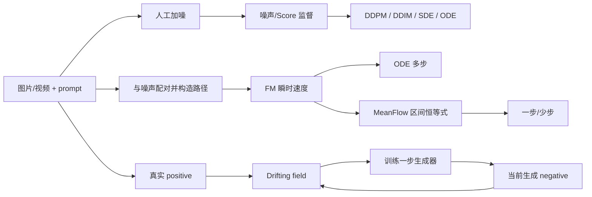

# 视频生成知识主干

> 只保留可跨论文复用的核心比喻、原理和公式。具体论文贡献和组会结构见 [视频生成论文精读与组会汇报指南_精简版.md](视频生成论文精读与组会汇报指南_精简版.md)。  
> 更新：2026-07-15

## 1. 先把各种名词放到正确层级

| 层级 | 它回答的问题 | 代表方法 |
|---|---|---|
| 数据表示 | 像素如何压缩成可计算表示 | VAE / tokenizer |
| 网络骨干 | 用什么网络预测向量或数据 | U-Net、DiT |
| 训练目标 | 网络学什么 | 噪声/Score、FM 速度、MeanFlow 平均速度、Drifting |
| 推理动力学 | 生成时每步怎样走 | DDPM、DDIM、SDE、ODE |
| 条件引导 | 怎样更听 prompt | CFG |
| 中间表示监督 | 怎样让主干更快学会视觉结构 | REPA |

```text
噪声 → 数据的主要学习思路
├─ Diffusion / Score：学带噪分布的密度坡度，通常多步生成
├─ Flow Matching：学概率路径上的瞬时速度
│  ├─ Rectified / Linear FM：用线性条件路径
│  ├─ OT-CFM：先优化噪声—数据配对
│  └─ MeanFlow：学区间平均速度，面向一步/少步
└─ Drifting：在训练中用真/假集合改造一步生成器

CFG 可叠加在噪声、Score、FM 速度或 MeanFlow 上。
U-Net / DiT 只是承载上述预测任务的网络骨干。
```

## 2. VAE、U-Net 和 DiT：数据怎样进出模型

### 2.1 VAE：先把视频压进 latent

大模型通常不直接处理所有像素，而是：

```text
图像/视频 x → VAE Encoder → latent z → 生成模型 → VAE Decoder → 像素
```

VAE 的核心目标是重建与正则化：

$$
\mathcal L_{\text{VAE}}
=\mathbb E[-\log p_\psi(x\mid z)]
+\beta D_{\mathrm{KL}}
\big(q_\phi(z\mid x)\,\|\,\mathcal N(0,I)\big).
$$

压缩越强，token 越少，但纹理和快速运动越容易丢失。若一个 latent 对应多种高频细节，MSE/高斯重建倾向输出它们的平均，所以看起来过度平滑。

### 2.2 用肿瘤分割理解 U-Net

可把 U-Net 想成两条同时保留的信息线：

```text
下采样：分辨率降低，但语义越来越强
  浅层：边缘、纹理、精确坐标
  中层：“这个区域像肿瘤”、“像出血/血管异常”
  深层：整体器官、病灶类型和上下文

上采样：恢复分辨率
  每升一层，把当前语义特征与同尺寸原图特征拼接
  再卷积，逐渐确定“是什么”以及“精确在哪里”
```

核心是 skip connection：若只用低分辨率语义图放大，一整块都可能像病灶；跳连把原图的边界和坐标送回来，才能精确分割。

> “某层就是肿瘤层”只是理解比喻。真实通道是分布式特征，不会天然拥有人类命名。

U-Net 早期适合扩散，因为扩散每步都要输入一张带噪图，输出同尺寸噪声/Score，而 U-Net 正好同时擅长全局语义和像素定位。

### 2.3 DiT：把 U-Net 骨干换成 Transformer

```text
像素 x
  → VAE Encoder
latent z
  → 加噪得 z_t
  → patchify 为 token + 位置编码
  → Transformer blocks
       时间 t：adaLN 等调制
       文本 c：cross-attention / 双流融合
  → unpatchify
  → 噪声、Score 或速度预测
```

DiT 不改变扩散/FM 的数学目标，只是替换预测网络。Transformer 的全局 attention 和规模收益适合大模型；VAE 压缩则使 token 数变得可承受。

### 2.4 REPA：让外部视觉教师帮中间层搭骨架

仅用最终噪声/速度损失时，DiT 的浅层需要自己慢慢发现空间结构。REPA 将已训好的视觉编码器特征当作冻结教师：

$$
\mathcal L
=\mathcal L_{\text{gen}}
+\lambda\,
d\big(P(h_l),\operatorname{sg}(T(x))\big).
$$

$h_l$ 是生成模型中间层，$T(x)$ 是教师特征，$P$ 负责对齐维度。这就是提高“监督密度”：不只在最终输出给信号，还给中间抽象阶段直接目标。它主要加速主干表示形成，不会自动找回已被 VAE 丢失的高频细节。REPA-E 将对齐扩展到 VAE 与 DiT 联合训练，iREPA 则更强调 teacher patch 特征的空间结构。

## 3. Diffusion 与 Score：自己加噪，所以知道怎样回去

### 3.1 什么是 Score

$$
s_t(x,c)=\nabla_x\log p_t(x\mid c).
$$

Score 是“整张图/latent 在高维概率空间中，朝哪里改动能最快进入高密度区”，不是图像边缘梯度，也不是更新参数的 $\nabla_\theta\mathcal L$。

真实图像在高维空间中太稀疏，无法先统计完整密度再求导。Diffusion 用高斯噪声把每个数据点抚平成一团云。

### 3.2 一张图如何直接产生 Score 标签

对图片与 prompt $(x_0,c)$，随机抽时间 $t$ 和噪声 $\epsilon$：

$$
x_t=\alpha_t x_0+\sigma_t\epsilon,
\qquad
\epsilon\sim\mathcal N(0,I).
$$

已知加噪分布为：

$$
q(x_t\mid x_0)=\mathcal N(\alpha_tx_0,\sigma_t^2I).
$$

它的 score 可直接算：

$$
\nabla_{x_t}\log q(x_t\mid x_0)
=-\frac{x_t-\alpha_tx_0}{\sigma_t^2}
=-\frac{\epsilon}{\sigma_t}.
$$

因此不必显式估计整体密度，只需要回归自己加进去的噪声：

$$
\mathcal L_{\text{DSM}}
=\mathbb E\left\|
s_\theta(x_t,t,c)+\frac{\epsilon}{\sigma_t}
\right\|^2.
$$

对同一个带噪位置，不同图片可能提供不同“回去方向”。MSE 的最优输出是这些方向的条件平均：

$$
s_\theta^*(x_t,t,c)
=\mathbb E\left[-\frac{\epsilon}{\sigma_t}
\,\middle|\,x_t,t,c\right]
=\nabla_{x_t}\log p_t(x_t\mid c).
$$

> 核心比喻：每张图只告诉模型“这次怎样撤销我身上的噪声”；大量图片、噪声和时刻上的条件平均，才隐式形成整个带噪分布的坡度地图。

### 3.3 Prompt 如何进入 Score

$$
e_c=\operatorname{TextEncoder}(c),
\qquad
s_\theta(x_t,t,e_c).
$$

prompt token 通过 cross-attention、adaLN 或双流结构接入主干。大量 $(x_0,c)$ 配对让网络学会“在这个 prompt 下，什么样的视觉结构是高概率的”。它学的是 $p_t(x_t\mid c)$，不是为每个 prompt 指定唯一图片。

### 3.4 噪声预测、Score、$x_0$-prediction 与 diffusion $v$

DDPM 常用：

$$
\mathcal L_\epsilon
=\mathbb E\|\epsilon_\theta(x_t,t,c)-\epsilon\|^2,
\qquad
s_\theta\approx-\frac{\epsilon_\theta}{\sigma_t}.
$$

也可换算干净样本：

$$
\hat x_0
=\frac{x_t-\sigma_t\hat\epsilon}{\alpha_t}
=\frac{x_t+\sigma_t^2s_\theta}{\alpha_t}.
$$

对常见 $\alpha_t^2+\sigma_t^2=1$ 约定，diffusion $v$-prediction 常定义为：

$$
v=\alpha_t\epsilon-\sigma_t x_0.
$$

这些是同一加噪状态的不同参数化，在给定 schedule 后可以换算。diffusion $v$ 不要在没有说明路径和时间约定时，直接与 FM 速度混为一谈。

### 3.5 DDPM 与 DDIM：同一个常见网络，两种走法

DDPM 按反向高斯转移逐步采样：

$$
x_{t-1}=\mu_\theta(x_t,t,c)+\sqrt{\tilde\beta_t}\,z,
\qquad z\sim\mathcal N(0,I).
$$

DDIM 先估计 $\hat x_0$，再在更低噪声等级 $s<t$ 重组：

$$
x_s=\alpha_s\hat x_0+\sigma_s\hat\epsilon
$$

常用确定性 DDIM 不在途中加新噪声，因而适合跳步。

```text
DDPM：估计当前反向分布 → 随机采下一步
DDIM：估计干净样本 → 按新噪声比例确定性重组
```

连续视角中，前向扩散可写为 $dx=f(x,t)dt+g(t)dW_t$。反向 SDE 使用 score 修正 drift：

$$
dx=\big[f(x,t)-g(t)^2s_\theta(x,t,c)\big]dt
+g(t)d\bar W_t.
$$

Probability Flow ODE 去掉途中随机项：

$$
dx=\left[f(x,t)-\frac12g(t)^2s_\theta(x,t,c)\right]dt.
$$

这里按从噪声端向数据端的反向时间积分理解。SDE 中的 drift $f$ 是动力学系数，与第 7 节的 Drifting Model 不是一个概念。

## 4. CFG：放大 prompt 额外施加的方向

训练时以一定概率丢弃条件，使同一模型学到有条件与无条件输出。推理时：

$$
y_{\text{CFG}}
=y_{\text{uncond}}
+w\big(y_{\text{cond}}-y_{\text{uncond}}\big).
$$

$y$ 可以是噪声、Score、FM 速度或 MeanFlow 平均速度。在 Score 视角下：

$$
s_{\text{cond}}-s_{\text{uncond}}
=\nabla_x\log p(c\mid x_t).
$$

所以两路相减是在抽出“prompt 额外要求”，再用 $w$ 放大。$w$ 过大会降低多样性并产生过饱和、伪影。

> CFG 的“相减”是两份模型预测的条件差；FM 的 $x_1-x_0$ 是训练路径的位移。符号都是减法，含义不同。

## 5. Flow Matching 与 OT：先构造路，再学导航

### 5.1 线性 FM 的训练目标

抽噪声起点 $z_0$ 和条件数据终点 $z_1$：

$$
z_0\sim\mathcal N(0,I),
\qquad
z_1\sim p_{\text{data}}(\cdot\mid c).
$$

构造线性中间点与已知速度：

$$
z_t=(1-t)z_0+tz_1,
\qquad
u_t=z_1-z_0.
$$

训练网络：

$$
\mathcal L_{\text{FM}}
=\mathbb E\|v_\theta(z_t,t,c)-(z_1-z_0)\|^2.
$$

多条训练路线可能穿过同一中间点，MSE 会学到条件平均：

$$
v^*(x,t,c)
=\mathbb E[z_1-z_0\mid z_t=x,t,c].
$$

因此推理时不需要知道新噪声对应哪张真图，只查询已学会的分布级导航：

$$
\frac{dz}{dt}=v_\theta(z,t,c),
\qquad
z_{k+1}=z_k+\Delta t\,v_\theta(z_k,t_k,c).
$$

Euler 求解器若均匀用 $N$ 步从 0 走到 1，则 $\Delta t=1/N$。更小步长误差通常更小，但网络调用次数 NFE 更多。

> 比喻：训练时可以看到很多完整路线，因而给每个中间位置写下“此刻应往哪里走”。推理时新旅客没有预先指定终点，但可以反复查这张导航图，最后使整体旅客分布到达目标城市分布。

### 5.2 OT 只改变训练配对

OT 在噪声与数据之间选择总运输成本小的配对：

$$
\pi^*=\arg\min_{\pi\in\Pi(p_0,p_1)}
\mathbb E_{(z_0,z_1)\sim\pi}
\|z_1-z_0\|^2.
$$

```text
OT：决定训练时“哪辆车配哪个仓库”
FM：学习中途的导航规则
ODE：推理时根据导航开车
```

普通 FM 可独立随机配对；OT-CFM 用 OT/mini-batch OT 降低路线交叉和监督方差。推理时不再求 OT，也不会搜索真实终点。FM 与 OT 不是同义词。

## 6. MeanFlow：从“每天花多少”学会“整月平均”

### 6.1 区间平均速度

设 $v(s)$ 是每天的消费速度，$u(r,t)$ 是 $[r,t]$ 内的日均消费：

$$
u(r,t)=\frac{1}{t-r}\int_r^t v(s)\,ds,
\qquad
(t-r)u(r,t)=\int_r^t v(s)\,ds.
$$

对终点 $t$ 求导：

$$
\frac{d}{dt}\big[(t-r)u(r,t)\big]=v(t),
$$

得到 MeanFlow 恒等式：

$$
u(r,t)=v(t)-(t-r)\frac{du(r,t)}{dt}.
$$

> 比喻：老师不给某个月的完整账本和平均值，只在大量练习中随机展示某个时刻的局部消费速度，并要求网络报出的区间平均值始终满足“总额 = 时长 $\times$ 平均值”的微分规律。网络不是现场累加账单，而是在训练后学会直接估计任意区间的平均值。

### 6.2 不直接提供平均速度，怎样训练

先说结论：**训练并没有在当场计算真实平均速度；它在学一个函数 $u_\theta$，使该函数对所有时间区间都满足“其隐含的瞬时速度等于已知瞬时速度”。**

所谓“自洽”，不是“网络自己觉得合理”，而是满足可检查的方程：

$$
u_\theta(r,t)
+(t-r)\frac{du_\theta(r,t)}{dt}
=v(t),
\qquad
u_\theta(t,t)=v(t).
$$

为什么这两条会强迫 $u_\theta$ 成为真实平均值？因为左边正好是乘积求导：

$$
\frac{d}{dt}\big[(t-r)u_\theta(r,t)\big]
=u_\theta(r,t)+(t-r)\frac{du_\theta}{dt}
=v(t).
$$

从 $r$ 积分到 $t$，又因为零长区间的总量为 0：

$$
(t-r)u_\theta(r,t)
=\int_r^t v(s)\,ds.
$$

于是只能得到：

$$
u_\theta(r,t)
=\frac{1}{t-r}\int_r^t v(s)\,ds.
$$

也就是真实区间平均速度。因此“自洽”的准确含义是：**网络预测的整段平均值、它随区间终点的变化率，以及局部瞬时速度三者必须对得上。**

#### 一个真正算出来的数字例子

假设瞬时速度随时间线性增长：

$$
v(t)=2t,
\qquad
r=0.
$$

如果我们真的做积分，$[0,t]$ 的平均速度是：

$$
u(0,t)
=\frac1t\int_0^t2s\,ds
=t.
$$

在 $t=1$ 时：

$$
u(0,1)=1,
\qquad
\frac{du}{dt}=1.
$$

用 MeanFlow 公式换回瞬时速度：

$$
u+(t-r)\frac{du}{dt}
=1+(1-0)\times1
=2
=v(1).
$$

在 $t=0.5$ 时也成立：

$$
u(0,0.5)+0.5\frac{du}{dt}
=0.5+0.5\times1
=1
=v(0.5).
$$

假如网络猜成 $u_\theta(0,t)=0.8t$，那么它隐含的瞬时速度是：

$$
V_\theta
=0.8t+t\times0.8
=1.6t,
$$

与训练目标 $v(t)=2t$ 不同，会产生误差并被修正。当这种检查在许多随机 $(r,t)$ 上都通过时，网络就学成了 $u(0,t)=t$，而不需要在推理时再做积分。

#### 真实生成模型为什么还需要 JVP

上面为了讲清楚，只写了时间 $t$。真实的网络输出 $u_\theta(z_t,r,t,c)$，而样本 $z_t$ 也随时间沿轨迹变化，所以需要总导数：

$$
\frac{du_\theta}{dt}
=J_z u_\theta\,v_t+\partial_tu_\theta.
$$

JVP 可直接计算这个 Jacobian-vector product，不需要显式建立完整 Jacobian。训练时随机抽 $0\le r\le t\le1$：

$$
u_{\text{target}}
=\operatorname{sg}\left[
v_t-(t-r)\frac{du_\theta}{dt}
\right],
\qquad
\mathcal L=\|u_\theta-u_{\text{target}}\|^2.
$$

短区间边界 $u(t,t)=v(t)$ 把局部答案钉住，大量长短区间共享网络，微分恒等式则使该函数只能逐渐逼近真实积分平均。

### 6.3 推理与边界

按 MeanFlow 论文常用时间约定，$t=1$ 是噪声，$r=0$ 是数据：

$$
z_0=z_1-(1-0)u_\theta(z_1,0,1,c).
$$

一步跨全程没有中途纠错，所以误差通常比多步大；分成两到四段可用额外 NFE 换取纠错。

MeanFlow 学的是固定区间的净位移/平均速度，不等于把底层曲线几何上修直。Rectified Flow 侧重路径变直；MeanFlow 侧重学会跨段查询。

### 6.4 Improved MeanFlow（iMF）：输出仍是 $u$，改用已知 $v$ 来批改

[*Improved Mean Flows: On the Challenges of Fastforward Generative Models*](https://arxiv.org/abs/2512.02012) 主要修复原 MeanFlow 的两个问题：

1. 原训练目标依赖网络自己，并在 JVP 中使用高方差的单对样本速度，训练不稳定；
2. 为保持 1-NFE，原 MeanFlow 将 CFG 强度在训练时固定，推理时不能自由调整。

#### 第一个改进：从“自己给自己出 $u$ 答案”改成标准 $v$ 回归

令 $x$ 为数据、$e$ 为噪声：

$$
z_t=(1-t)x+te,
\qquad
v_c=e-x.
$$

$v_c$ 是当前噪声—数据对的已知 conditional velocity。原 MeanFlow 根据：

$$
u=v-(t-r)\frac{du}{dt}
$$

构造伪目标：

$$
u_{\text{tgt}}
=v_c-(t-r)\operatorname{JVP}(u_\theta;v_c),
qquad
\mathcal L_{\text{MF}}
=\|u_\theta-\operatorname{sg}(u_{\text{tgt}})\|^2.
$$

问题在于：目标中含有 $u_\theta$，而 JVP 的切向量还是单对样本的 $v_c=e-x$。同一 $z_t$ 可由很多 $(x,e)$ 产生，这些 $v_c$ 方差很大，JVP 会将这种方差放大。

iMF 先将 MeanFlow 恒等式换一个方向写：

$$
v=u+(t-r)\frac{du}{dt}.
$$

网络仍预测平均速度 $u_\theta$，但用它组合出一个“隐含的瞬时速度”：

$$
V_\theta(z_t,r,t)
=u_\theta(z_t,r,t)
+(t-r)\operatorname{JVP}_{\operatorname{sg}}
\big(u_\theta;v_\theta\big).
$$

其中 $v_\theta$ 不再用单对高方差的 $e-x$ 充当 JVP 切向量，而是用当前状态的边缘/marginal velocity 预测。最简做法利用边界条件：

$$
v_\theta(z_t,t)
\equiv u_\theta(z_t,t,t).
$$

也可以加一个训练期专用的 auxiliary $v$-head，推理时丢掉该 head。

最终直接对已知 $v_c=e-x$ 做标准回归：

$$
\mathcal L_{\text{iMF}}
=\mathbb E\left\|
V_\theta(z_t,r,t)-(e-x)
\right\|^2.
$$

现在的“答案” $e-x$ 不依赖网络；$V_\theta$ 的输入只来自 $z_t$、时间和条件，不再将单对样本的 $e-x$ 偷塞进 JVP 预测函数。MSE 会在多个 $(x,e)$ 上学到稳定的 marginal velocity。

##### “学生自己的猜测”和“某个人的偶然账单”从哪里来

| 量 | 是否已知 | 来源 |
|---|---|---|
| 真实区间平均速度 $u(z_t,r,t)$ | 不知道 | 需沿真实 marginal ODE 积分，训练时无法直接得到 |
| 学生自己的猜测 $u_\theta(z_t,r,t)$ | 已知 | 就是当前网络前向输出 |
| 单对样本速度 $v_c=e-x$ | 已知 | 训练亲手抽了真数据 $x$ 和噪声 $e$，线性路径的导数因而可精确计算 |
| 真实 marginal velocity $v(z_t)$ | 不知道 | 是所有可能 $(x,e)$ 在给定 $z_t$ 下的平均 |

所谓“偶然账单”并不是“账单数字不知道”，而是：**这次抽到的 $v_c=e-x$ 数值完全已知，但它只是许多可能路线中的一条，对同一 $z_t$ 来说具有抽样随机性。**

$$
v(z_t)
=\mathbb E[e-x\mid z_t].
$$

因此不要把这个比喻理解为“我有一个真实但未知的本月账单”。更准确的类比是：有许多个人可能在当前具有同样的账户状态 $z_t$，老师每次抽一个人，所以知道这个人当天的具体消费 $v_c$；但“所有同状态人的当日平均消费 $v(z_t)$”与“整段平均消费 $u$”仍是未知的。

##### “将 $u_\theta$ 换算成它隐含的瞬时速度”是怎样做到的

这不是凭空猜测，而是直接使用 MeanFlow 恒等式：

$$
v=u+(t-r)\frac{du}{dt}.
$$

网络 $u_\theta(z,r,t)$ 是一个可微函数。给定当前点后，自动微分可计算它沿轨迹的变化率：

$$
\frac{du_\theta}{dt}
=\partial_z u_\theta\,v_\theta
+\partial_tu_\theta.
$$

这就是 JVP。其中 $v_\theta$ 由零长度区间的边界条件得到：

$$
v_\theta(z_t,t)
=u_\theta(z_t,t,t).
$$

因为当 $r=t$ 时，区间已缩成一个时刻，区间平均速度就是该时刻的瞬时速度。最后代回恒等式：

$$
V_\theta
=u_\theta(z_t,r,t)
+(t-r)
\left(
\partial_z u_\theta\,v_\theta
+\partial_tu_\theta
\right).
$$

$V_\theta$ 就是“当前这个 $u_\theta$ 函数如果自洽，那么它所隐含的瞬时速度应该是什么”。训练再用已知的抽样标签 $v_c=e-x$ 监督它：

$$
\mathcal L_{\text{iMF}}
=\mathbb E\|V_\theta-v_c\|^2.
$$

对大量 $(x,e)$ 抽样做 MSE，最优 $V_\theta$ 会趋近条件平均 $\mathbb E[v_c\mid z_t]$，也就是真正的 marginal velocity $v(z_t)$。

```python
# 仅表示 iMF 的核心数据流
v_pred = fn(z, t, t)  # 边界：u(z,t,t) = v(z,t)
u_pred, du_dt = jvp(
    fn,
    (z, r, t),
    (v_pred, 0, 1),   # 沿 z 的 v_pred 方向和时间方向求导
)
V_pred = u_pred + (t - r) * stopgrad(du_dt)
loss = mse(V_pred, e - x)
```

> 修正后的消费比喻：网络直接报告“区间平均消费 $u_\theta$”；阅卷程序再看这个平均值随终点和账户状态如何变化，根据 $v=u+(t-r)du/dt$ 换算出它隐含的当日消费 $V_\theta$；然后用许多个人已知的当日账单 $v_c$ 训练，最终学到同状态人群的平均规律。

iMF 仍使用 JVP，也仍在 JVP 结果上使用 stop-gradient，以避免更难优化的高阶参数梯度。它并没有退化成普通 FM：推理仍只取 $u_\theta(z_1,0,1)$ 做一步跨段生成。

#### 第二个改进：把 CFG 强度变成可调条件

原 MeanFlow 为了将 CFG 吸收到一次网络调用中，训练时需要先固定 guidance scale $\omega$：

$$
v_{\text{cfg}}(z_t\mid c)
=\omega v(z_t\mid c)+(1-\omega)v(z_t).
$$

但最优 $\omega$ 会随模型大小、训练时长和 NFE 改变。iMF 训练时随机抽 $\omega$，并将它像 $r,t$ 一样作为显式条件：

$$
u_\theta
=u_\theta(z_t\mid r,t,c,\omega).
$$

因此同一个 1-NFE 模型在推理时可直接换 $\omega$，而不必重新训练或做两次 CFG 前向。论文还将 CFG 生效区间 $t_{\min},t_{\max}$ 也作为条件。

#### 第三个改进：用 in-context tokens 承载多种条件

完整模型要同时处理：

$$
u_\theta(z_t\mid r,t,c,\Omega),
\qquad
\Omega=\{\omega,t_{\min},t_{\max}\}.
$$

iMF 不再将所有异质条件相加后全部压给 adaLN-zero，而是将每种条件变成多个 token，与图像 latent tokens 串在同一 Transformer 序列中。论文报告，移除参数较多的 adaLN-zero 后，同宽度/深度的 Base 模型从 133M 降到 89M，约减少三分之一参数。

#### 最后如何记住

```text
原 MeanFlow：
网络输出 u
→ 用网络自己和高方差单样本速度构造 u 伪标签
→ 回归 u；CFG 强度需预先固定

iMF：
网络仍输出 u
→ 用稳定的 v_theta 作 JVP 切向量，把 u 转成隐含瞬时速度 V_theta
→ 直接与已知 e-x 做 v-loss；CFG 强度是可调输入条件
```

论文 v2 报告 ImageNet $256\times256$ 上 1-NFE FID 1.72，原 MeanFlow 基线为 3.43；方法从零训练，不使用蒸馏。这是论文自报的类别条件实验，不等于已在大规模文本到视频上验证同等收益。

## 7. Drifting Model：训练时调整分布，推理时一次输出

这里特指 [*Generative Modeling via Drifting*](https://arxiv.org/abs/2602.04770)，不是 SDE 的 drift。

### 7.1 固定噪声是确定点，但没有指定真实终点

在第 $k$ 轮训练中，固定 $\epsilon_i,c,\theta_k$ 后：

$$
x_i^{(k)}=f_{\theta_k}(\epsilon_i,c)
$$

是确定点。但数据集不会说“$\epsilon_i$ 必须变成第 $j$ 张真图”，只要求所有噪声输出的整体分布：

$$
q_\theta=f_{\theta\#}p_\epsilon
$$

接近真实条件分布。

> 分座位比喻：噪声是车票编号，生成器是分座位机器。当前机器固定时，17 号票的座位确定；但训练数据只给真实乘客的整体座位分布，不会指定 17 号必须坐 A3。训练通过批数据发现哪些区域缺人或过度拥挤，修改的是整台分座位机器。

### 7.2 类磁场比喻：真实吸引减生成拥挤

可以把每轮 Drifting 训练想成在特征空间临时建造一个“类磁场”：

```text
真实样本 ● ● ●：吸引源，告诉生成点真实数据在哪些方向
生成样本 ○ ○ ○：排斥源，告诉它哪些方向已经太拥挤
当前点 x       ：同时受到两组源产生的合场 V(x)
```

更准确地说，它是**核加权的吸引—排斥向量场**，不是满足麦克斯韦方程的真实磁场。

大图像通常先经冻结视觉编码器 $\phi$。下面为简化符号，仍用 $x,y$ 表示原始点或对应特征点 $\phi(x),\phi(y)$。距离越近，互动越强：

$$
k(x,y)
=\exp\left(
-\frac{\|x-y\|}{\tau}
\right).
$$

$\tau$ 是温度：$\tau$ 越小，场越关注最近的样本；$\tau$ 越大，更远的样本也会明显参与。

对当前生成点 $x$，真实 positive $y^+\sim p$ 产生吸引场：

$$
V_p^+(x)=
\frac{\mathbb E_p[k(x,y^+)(y^+-x)]}
{Z_p(x)},
\qquad
Z_p(x)=\mathbb E_p[k(x,y^+)].
$$

它是“附近真实样本的加权中心减去当前位置”。其他生成 negative $y^-\sim q_\theta$ 产生拥挤场：

$$
V_q^-(x)=
\frac{\mathbb E_q[k(x,y^-)(y^--x)]}
{Z_q(x)},
\qquad
Z_q(x)=\mathbb E_q[k(x,y^-)].
$$

最终合场为：

$$
V_{p,q}(x)=V_p^+(x)-V_q^-(x),
$$

将两项合并，可更直观地看到“真实源减生成源”：

$$
V_{p,q}(x)
=\frac{1}{Z_p(x)Z_q(x)}
\mathbb E_{y^+\sim p,\,y^-\sim q}
\left[
k(x,y^+)k(x,y^-)(y^+-y^-)
\right].
$$

这个场具有反对称性：

$$
V_{p,q}(x)=-V_{q,p}(x).
$$

因此当生成分布与真实分布相同时：

$$
q=p
\quad\Longrightarrow\quad
V_{p,q}(x)=0.
$$

直观上，同一组样本同时作为吸引源和排斥源，两个场恰好抵消，系统达到平衡。但对任意乱造的场，$V=0$ 不一定反推出 $p=q$；论文依赖特定核设计与非退化条件近似保证这一点。

当 negative 就是当前生成 batch 时，论文明确排除距离矩阵对角线的“自己与自己”。即使不排除，自身位移 $x-x=0$，也不会产生无穷排斥。

实际 batch 用来近似整个 $q_\theta$：一个点只能告诉自己在哪里，其他生成点才能告诉它附近是否拥挤。

这个“磁场”不是固定的：每次 SGD 更新生成器后，$q_\theta$ 和生成源的位置都变了，下一 batch 必须重新计算 $V_{p,q_\theta}$。训练完成后，场的累积作用已写入生成器参数，推理时不再建场。

### 7.3 训练与推理

“训练生成器追赶”的准确意思是：**先在当前输出前方画一个临时目标点，将它冻结，再更新生成器参数，使下一次输出向该点靠近。**

对某个噪声 $\epsilon$，当前输出是：

$$
x_\theta=f_\theta(\epsilon).
$$

根据当前真实/生成 batch 计算 drifting field $V(x_\theta)$，在它前方放一个伪目标：

$$
x_{\text{tgt}}
=\operatorname{sg}\big[x_\theta+V(x_\theta)\big].
$$

$\operatorname{sg}$ 是 stop-gradient：反向传播时把 $x_{\text{tgt}}$ 当作一张冻结的快照，不让它随着学生的答案一起移动。损失为：

$$
\mathcal L
=\mathbb E_\epsilon
\|x_\theta-x_{\text{tgt}}\|^2.
$$

由于目标已冻结，对当前输出的梯度非常直观：

$$
\frac{\partial\mathcal L}{\partial x_\theta}
=2(x_\theta-x_{\text{tgt}})
=-2V(x_\theta).
$$

梯度下降因此会倾向将输出沿 $+V$ 方向推动。真正更新的不是一个可单独保存的 $x$，而是共享参数 $\theta$：

$$
\theta'=	heta-\eta\nabla_\theta\mathcal L,
\qquad
x' = f_{\theta'}(\epsilon).
$$

因为学习率很小且参数被所有噪声共享，$x'$ 只是向目标靠近，不会一次精确跳到 $x_{\text{tgt}}$。

一个一维例子：

```text
当前输出：x = 3.0
当前场：  V = +0.4
冻结目标：x_tgt = 3.4

做一次小的参数更新后：
同一噪声的新输出可能是 3.08，即向 3.4 追了一小步。
下一轮再用新生成 batch 重算场和新目标。
```

所以这是一个“重新画箭头 → 追一小步 → 再重新画箭头”的训练过程。它不是追赶某张事先配对的真图，而是追赶由当前真/假两个分布构造的临时分布修正方向。图像实验常在特征 $\phi(x)$ 上计算该损失，梯度再穿过冻结特征编码器传回生成器。

```text
训练：多个噪声 → 生成 batch → 与真实 batch 计算 V → 更新共享生成器
推理：一个噪声 + 条件 → 训好的生成器 → 一张图
```

一个点足够生成，但一个点不足够学习分布。推理时不再需要真实样本或 drifting field，因为分布调整已通过 SGD 写入 $f_\theta$。

### 7.4 与 Score 和对比学习的区别

- Score 是单个带噪概率密度的对数梯度 $\nabla_x\log p_t(x\mid c)$，生成时需要查询。
- Drifting field 是真实分布与当前生成分布的核加权吸引减拥挤，只在训练时使用。
- Drifting 像对比学习，是因为使用 positive / negative 和类 InfoNCE softmax；但对比学习主要学特征编码器，Drifting 学一步生成映射。

论文大规模实验主要是 ImageNet 类别条件，不应直接把其结论视为已验证的任意长文本到图像方案。

### 7.5 “预测 $v$ 必然模糊，Drifting 是随机算子”吗

这种说法抓住了部分直觉，但数学上不严谨。

**正确部分**：

- FM 通常学局部、随时间变化的速度 $v_\theta(x,t,c)$，推理时通过 ODE 反复查询它。
- Drifting 不学推理时的路线，而是在训练中用 $p$ 与当前 $q_\theta$ 的差异，直接改造一步生成映射 $f_\theta(z,c)$。
- 如果用 MSE 直接让同一输入回归多个互相冲突的最终图像，确实容易得到条件平均，表现为折中或模糊。

**需要修正的部分**：

1. **Drifting 通常也是确定函数。**固定模型、条件和噪声后：

   $$
   x=f_\theta(z,c)
   $$

   通常是确定的。随机性主要来自 $z\sim p_z$，而不是 $f_\theta$ 本身必然是“随机算子”。

2. **确定函数可以保留完整分布。**若 $z$ 随机，那么确定映射的输出仍然是随机分布：

   $$
   z\sim p_z,
   \qquad
   x=f_\theta(z)sim f_{\theta\#}p_z.
   $$

   例如目标分布只有 $-1$ 和 $+1$ 两个模态，确定函数

   $$
   f(z)=\begin{cases}
   -1,&z<0,\\
   +1,&z\ge0
   \end{cases}
   $$

   就能把对称噪声一分为二，产生完整的双峰分布，而不是平均值 0。

3. **FM 的条件平均速度不等于平均图像。**

   $$
   v^*(x,t,c)
   =\mathbb E[u_t\mid x_t=x,t,c]
   $$

   虽是对穿过同一中间状态的速度取条件平均，但它的任务是使整个密度满足连续性方程：

   $$
   \partial_t p_t(x)
   +\nabla\cdot\big(p_t(x)v_t(x)\big)=0.
   $$

   在理想路径、无限数据和足够模型容量下，确定性 ODE 可以将随机初始分布完整运输到目标分布，不会必然模糊。

因此更准确的对比是：

| 方法 | 确定性来源 | 随机性来源 | 主要学什么 |
|---|---|---|---|
| FM | 固定 $x,t,c$ 时 $v_\theta$ 确定；固定初始点时 ODE 轨迹确定 | 初始噪声 $z$ | 局部时间速度场 |
| Drifting | 固定 $z,c$ 时 $f_\theta(z,c)$ 确定 | 输入噪声 $z$ | 直接的一步生成映射 |

**演员比喻可以保留，但要改写**：

```text
FM：演员拿到一本“每个时刻、每个处境下应怎样表演”的动态剧本，
    从不同随机初始状态出发，沿剧本一步步演到结局。

Drifting：训练期间根据“观众期待的角色分布”不断调整演员，
          使他一上场就能进入某个合理角色状态。
```

两者都可因随机 $z$ 产生多样结果。FM 的实际模糊或信息损失主要来自路径交叉导致的监督方差、有限容量、大步长积分误差或 VAE 瓶颈，而不是“预测确定 $v$ 必然丢失随机性”。Drifting 也不会自动完美保留所有模态，仍受核、特征空间、batch 大小和模型容量限制。

### 7.6 高维噪声会不会“落空”？局部核怎样学全局映射？

#### Q1：数据流形体积近乎为零，一个高斯噪声点凭什么命中它？

这个问题将两个空间混在了一起：

```text
噪声空间：z 是生成器的输入编码
数据空间：x = f_theta(z,c) 才是图像/latent 中的输出点
```

推理并不是在图像空间直接丢下随机 $z$，然后希望它巧合掉在数据流形上；而是计算一个已学习的映射：

$$
f_\theta:\mathbb R^{d_z}\to\mathbb R^{d_x},
\qquad
x=f_\theta(z,c).
$$

> 比喻：$z$ 像一串随机票号，不是城市里的地理坐标；$f_\theta$ 是把票号分配到合理地址的机器。票号本身不需要“靠近地址”。

若把一步生成写成转移核，对通常的确定生成器：

$$
T_\theta(dx\mid z,c)
=\delta_{f_\theta(z,c)}(dx).
$$

输出分布是先验经过该映射的 pushforward：

$$
q_\theta(dx\mid c)
=\int T_\theta(dx\mid z,c)p_z(dz)
=f_{\theta\#}p_z.
$$

对任意输出区域 $A$：

$$
q_\theta(A\mid c)
=\Pr_{z\sim p_z}\big[f_\theta(z,c)\in A\big].
$$

如果真能训到 $q_\theta=p_{\text{data}}$，那么对真实分布概率为零的无效区域 $A$，自然有 $q_\theta(A)=0$。这是“分布已匹配”的结果，不是噪声靠随机运气命中流形。

高维高斯的测度集中也不会自动造成“落空”：训练和推理都从同一 $p_z$ 抽样，因而模型主要在高斯的 typical set 上接收训练并被调用。手工输入极端离群的 $z$ 仍可能失败，但标准采样几乎不会访问那些区域。

**论文不保证逐点满射。**生成建模需要的是按概率测度覆盖目标分布，而不是每个数据点都必须存在一个 $z$ 精确映射到它。严格满射既更强，也对分布匹配没有必要；零测集上的个别点不会改变生成分布。

但维度与容量仍是硬约束：若 $f_\theta$ 是常见平滑/Lipschitz 映射，而噪声有效维度 $d_z$ 低于目标分布的内在维度，它不可能精确覆盖后者。Drifting 不会消除这个几何限制；需要足够的噪声维度、模型容量和条件/额外随机输入。这些条件使“存在良好映射”变得可能，但仍不等于训练一定找到它。

Drifting 的反对称性只直接给出：

$$
q=p\quad\Longrightarrow\quad V_{p,q}=0.
$$

论文在特定核与非退化条件下给出“$V\approx0$ 促使 $q\approx p$”的可辨识性启发，但**没有证明 SGD 从任意初始化必然全局收敛，也没有证明 $f_\theta$ 对数据流形满射**。模态覆盖仍是经验结果和实际风险。

#### Q2：核 $K$ 如果只学真图附近的局部恢复，怎样处理遥远纯噪声？

这个前提不符合 Drifting 的训练方式：

1. $K$ 不是“给真图做小扰动，再学恢复”的加噪核。
2. $K$ 是当前生成输出与真实/生成样本在特征空间的相似度：

   $$
   K(x,y)=\exp\left(-\frac{\|\phi(x)-\phi(y)\|}{\tau}\right).
   $$

3. 训练每轮从一开始就抽完整先验噪声：

   $$
   z_i\sim p_z,
   \qquad
   x_i^{(k)}=f_{\theta_k}(z_i,c).
   $$

所以训练不是“从真图旁边开始小修小补”，而是始终在调整“整个先验噪声经生成器后的当前输出”。核的局部性发生在**输出特征空间的比较**，不是输入噪声只能在真图附近走一小步。

经过多轮 SGD：

```text
先验噪声 z
  → 当前生成器输出 x
  → 在特征空间与真/假样本计算局部场 V
  → 用 x + V 构造本轮伪目标
  → 更新共享映射 f_theta
  → 下一轮同一 z 的输出也可能大幅改变
```

局部的是每轮输出空间中的反馈，而学到的 $f_\theta$ 是从整个 typical noise set 到数据空间的全局函数。这与“用局部梯度下降经过很多步训出一个全局分类器”类似：训练更新是局部的，函数能力可以是全局的。

但这仍然不是“任意远点都必定被拉回”的数学保证。如果生成特征与所有真实特征都很远，核值可能近似平坦，产生弱或无区分度的信号。论文通过以下设计缓解：

- 在预训练自监督特征空间中计算核，使“距离”更有语义；
- 对特征和 drift 做归一化；
- 结合多尺度特征、多温度、较多正负样本与样本队列；
- 使用 softmax 归一化相对距离，使最相近样本在绝对距离较大时仍可提供方向。

这个问题是真实工程局限：原文报告，在 ImageNet 上不使用有效特征编码器时，他们未能使方法成功工作。因此更准确的结论是：

> Drifting 不是依靠一次局部核把遥远噪声拉回流形，而是用很多轮输出空间的局部分布反馈，逐步训出全局一步映射。它对 typical prior samples 的有效覆盖是训练目标与实验结果，而不是已证明的满射或全局吸引子定理。

### 7.7 Prompt 怎样让模型进入“对应图片区域”

#### Prompt 选的不是一张目标图，而是一个条件分布

设 prompt 编码为：

$$
c=\operatorname{TextEncoder}(\text{prompt}).
$$

“一辆红色汽车”不对应图像空间中的一个唯一坐标，而对应许多可能样本：正面车、侧面车、夜景车、不同背景等。它们共同构成：

$$
p_{\text{data}}(x\mid c).
$$

随机噪声 $z$ 负责选择这个条件分布中的某个具体结果。因此生成目标是：

$$
z\sim p_z,
\qquad
x=f_\theta(z,c)sim q_\theta(x\mid c),
\qquad
q_\theta(x\mid c)\approx p_{\text{data}}(x\mid c).
$$

> 比喻：prompt 是“去红色汽车街区”，不是某栋房子的 GPS 坐标；噪声 $z$ 像街区内的随机门牌号，决定最后看到哪一辆红车。

#### Diffusion / FM 是怎样“流进去”的

对 Diffusion 或 FM，prompt 在每个中间时刻都参与预测：

$$
s_\theta(x_t,t,c)
\quad\text{or}\quad
v_\theta(x_t,t,c).
$$

因此当前点每到一个新位置，模型都会根据 prompt 重新回答“现在应往哪里走”：

$$
x_{k+1}
=x_k+\Delta t\,v_\theta(x_k,t_k,c).
$$

训练中大量图文配对已把“红色”、“汽车”与相应视觉结构的方向写进网络。推理时不会搜索训练集里的某张红车图；它查询的是已学会的条件向量场。CFG 还可放大 prompt 方向：

$$
v_{\text{guided}}
=v_{\text{uncond}}
+w(v_{\text{cond}}-v_{\text{uncond}}).
$$

#### Drifting 推理时其实没有“流进去”

Drifting 中有两条完全不同的时间轴：

| 时间 | 表示什么 | 样本怎样变 |
|---|---|---|
| Diffusion / FM 的 $t$ | 一次推理轨迹中的时刻 | 同一样本沿 Score/速度场多步移动 |
| Drifting 的训练迭代 $k$ | SGD 已经更新了多少轮参数 | 整个条件输出分布 $q_{\theta_k}(\cdot\mid c)$ 逐轮变化 |

真正的 Drifting 过程是：

$$
q_{\theta_0}(\cdot\mid c)
\longrightarrow
q_{\theta_1}(\cdot\mid c)
\longrightarrow\cdots\longrightarrow
q_{\theta_K}(\cdot\mid c)
\approx p_{\text{data}}(\cdot\mid c).
$$

这串箭头发生在**训练轮次之间**，不是一张图在推理时的轨迹。

训练某个条件 $c$ 时：

$$
y_j^+\sim p_{\text{data}}(\cdot\mid c),
\qquad
x_i=f_\theta(z_i,c),
\qquad
y_i^-\sim q_\theta(\cdot\mid c).
$$

只用同条件的真实 positive 与当前生成 negative 构造条件场：

$$
V_c(x)
=V^+_{p_{\text{data}}(\cdot\mid c)}(x)
-V^-_{q_\theta(\cdot\mid c)}(x).
$$

共享生成器同时接收 $z$ 和 $c$，所以不同条件的训练反馈逐渐写入同一组参数：

$$
\mathcal L_c
=\mathbb E_z
\left\|
f_\theta(z,c)
-\operatorname{sg}\big[f_\theta(z,c)+V_c(f_\theta(z,c))\big]
\right\|^2.
$$

推理时不再抽真实 positive，不再建场，也不逐步移动：

$$
z,c\longmapsto f_\theta(z,c)\longmapsto x.
$$

```text
Diffusion / FM：prompt 像每个路口都会更新的导航，推理时一步步进入目标街区。
Drifting：训练期间用各街区的真实人流反复校准一台传送机；
          推理时输入街区名和随机门牌号，一次传送到该街区的某个位置。
```

#### 一个两模态的小例子

将 prompt “红色汽车”的真实图像简化到一维特征：

```text
真实 positive： -2（正面红车）      +2（侧面红车）
当前 generated：-0.5              0              +0.5
```

- $x=-0.5$ 离左侧真实模态更近，核吸引更偏向 $-2$；
- $x=+0.5$ 更偏向 $+2$；
- 生成点之间的排斥防止所有 $z$ 都被映射到同一个模态；
- 不同 $z$ 逐渐被生成器分流到不同红车模态。

严格对称的 $x=0$ 仍然可能获得抵消信号；实际分流依赖随机非对称、batch、特征质量和共享网络学习，不是每个点都必然有唯一吸引终点。

#### Kaiming He 论文的条件边界

《Generative Modeling via Drifting》的大规模实验主要是 **ImageNet 类别条件**，不是任意自然语言 prompt。其直接做法是选类别 $c$，从该类真实数据中抽 positive，并生成同类别 negative。

若扩展到文本到图像，还需要解决：

- 用文本编码器将相近 prompt 组织到可泛化的条件空间；
- 根据图文配对或语义近邻抽取有效 positive / negative；
- 设计长文本条件注入、CFG 和大批训练。

因此不能把这篇类别条件论文直接描述成“已经证明可根据任意 prompt 找到图片位置并一步流过去”。

## 8. 统一看训练信号与推理过程

| 方法 | 单个训练例子提供什么 | 网络学什么 | 推理 |
|---|---|---|---|
| DDPM / Score | 自己加的噪声 $\epsilon$ | 噪声或等价 Score | 反向随机扩散，通常多步 |
| DDIM | 通常与 DDPM 相同 | 通常复用噪声/Score 模型 | 确定性或少随机跳步 |
| FM | 构造路径上的速度 | 瞬时速度场 | ODE 多步积分 |
| OT-CFM | 先用 OT 改善起终点配对 | 仍是 FM 速度 | 与 FM 相同，不再求 OT |
| MeanFlow | FM 瞬时速度 + 区间恒等式 | 区间平均速度 | 一步/少步 |
| Drifting | 真实 positive 与当前生成 negative | 直接噪声到数据映射 | 一步生成器 |
| CFG | 训练时偶尔丢条件 | 同时学条件/无条件输出 | 放大两者差值后交给采样器 |



## 9. 最后只记这九句

1. VAE 决定 token 成本与可恢复细节的上限。
2. U-Net 用下采样学“是什么”，用跳连保留“在哪里”；DiT 用 patch/token 和 Transformer 替换它的预测骨干。
3. Diffusion 自己加噪，所以能用 $-\epsilon/\sigma_t$ 监督 Score。
4. DDPM 与 DDIM 常复用同一模型，主要区别是推理怎样走。
5. CFG 放大“有 prompt”相对“无 prompt”多出的方向。
6. FM 学中间点的瞬时导航；OT 只改善训练配对。
7. MeanFlow 用瞬时速度与区间积分规律，学整段平均速度。
8. Drifting 在训练时用真实吸引减生成拥挤改造共享生成器，推理时只需一个噪声点。
9. 这些方法都会用 $\nabla_\theta\mathcal L$ 优化参数，但这不代表它们学的数学对象相同。
